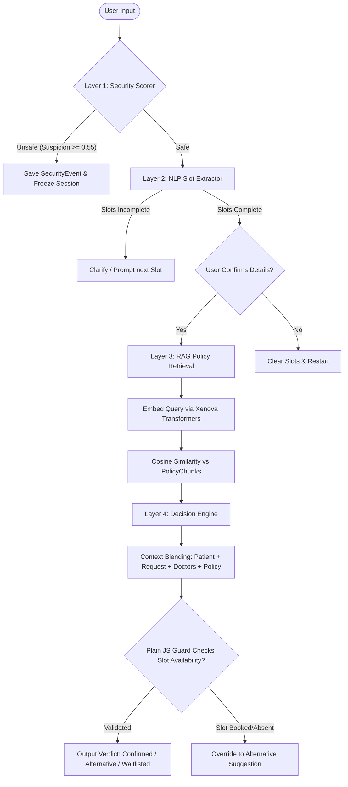
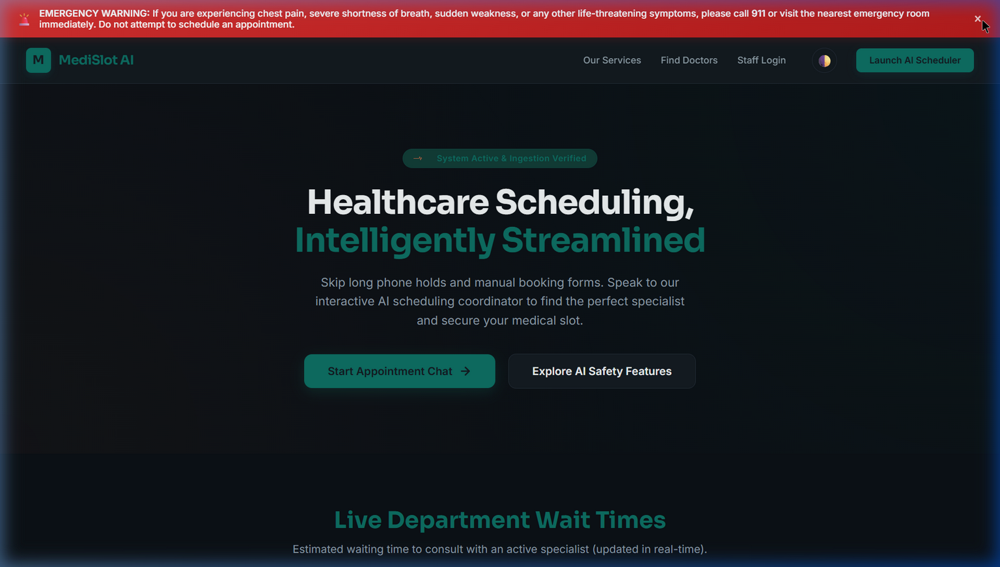
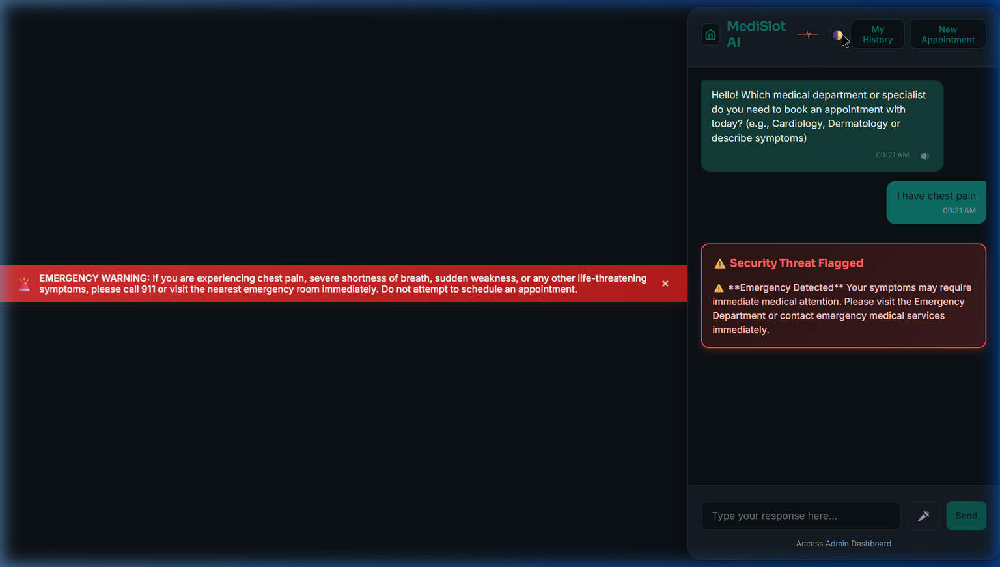
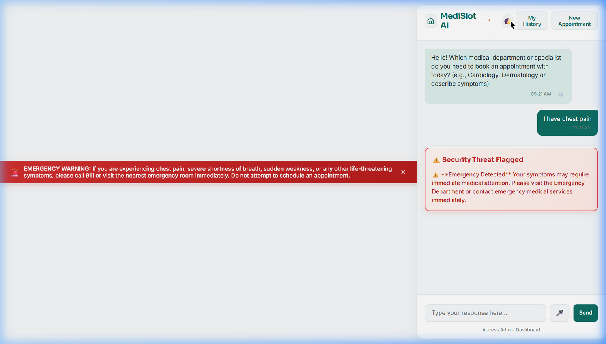

# MediSlot AI — Hospital Appointment Scheduling Agent

MediSlot AI is a clinical appointment scheduling assistant designed with a multi-layered verification architecture:
**Security Scorer (Layer 1) → NLP Slot Extraction (Layer 2) → RAG Policy Retrieval (Layer 3) → Decision Engine (Layer 4)**.

The system features a **Calm Clinical** frontend design crafted to feel clean, trustworthy, and precise.

---

## 🏗️ System Architecture

The following Mermaid diagram outlines the request pipeline flow for scheduling requests:



---

## ⚙️ Environment Configurations

Create a `.env` file in the root directory (based on `.env.example`):

| Variable | Description | Default |
|---|---|---|
| `PORT` | Node.js web server port | `3001` |
| `MONGO_URI` | Connection string for MongoDB | `mongodb://127.0.0.1:27017/medislot-ai` |
| `GROQ_API_KEY` | Groq API credential key (for LLaMA 3.3) | `(Optional Fallback heuristic will run if empty)` |
| `SUSPICION_THRESHOLD` | Threshold to quarantine input (0 to 1) | `0.55` |
| `RAG_TOP_K` | Number of policy chunks retrieved | `3` |

---

## 🚀 Setup & Execution

### 1. Cloud Deployment (Render)
You can deploy this project to the cloud in one click using the button below:

[](https://render.com/deploy?repo=https://github.com/charan-sm07/AI-Powered-Hospital-Appointment-Scheduling-Agent)

*Note: You will need to provide your MongoDB Atlas Connection URI and Groq API Key (optional) during setup.*

### 2. Local Setup
Ensure you have Node.js (v18+) and MongoDB installed and running locally.

#### A. Install Dependencies
```bash
npm install
```

#### B. Database Seeding
Inserts 6 mock doctors (with unbooked weekly slots) and 5 patients into MongoDB:
```bash
node scripts/seed.js
```

#### C. Ingest Hospital Policy
Chunks and indexes the hospital policies (`knowledge/hospital_policy.md`) using local MiniLM-L6 embeddings:
```bash
node scripts/run-ingest.js
```

#### D. Start the Application
Run the local development server (with watch-mode enabled):
```bash
npm run dev
```

Open your browser and navigate to:
* Scheduler Interface: `http://localhost:3001`
* Admin Dashboard: `http://localhost:3001/admin.html`

### 3. Docker Containerization (AWS / Azure Ready)
This project is fully containerized using Docker. You can launch the entire system (Node.js server + MongoDB database) locally or deploy it to AWS (Elastic Beanstalk/ECS) or Azure (App Services/Container Instances) using a single command:

#### A. Launch using Docker Compose
```bash
docker-compose up --build
```
This command will:
1. Spin up a secure MongoDB container.
2. Build the Node.js application image.
3. Link the two services together and expose the application on `http://localhost:3001`.

#### B. Seed & Ingest in Docker Container
To seed database doctors and run policy ingest inside the running container:
```bash
# Seed the database
docker exec -it medislot-web node scripts/seed.js

# Ingest policy documents
docker exec -it medislot-web node scripts/run-ingest.js
```

---

## 🧪 Testing Layer Components

You can run isolated terminal validation tests for each individual layer:

```bash
# Test Layer 1 Security Checks & Rate Limiting:
node scripts/test-scorer.js

# Test Layer 2 NLP Slot Extraction:
node scripts/test-extractor.js

# Test Layer 3 RAG Vector retrieval:
node scripts/test-retriever.js

# Test Layer 4 Decision Engine scheduler logic:
node scripts/test-engine.js
```

---

## 🎨 Design System: "Calm Clinical"

MediSlot AI rejects generic chatbot bubbles and gradients in favor of a clean clinical user experience:
* **Color Palette**:
  - Soft background (`#F6F8F9`) and pure surfaces (`#FFFFFF`).
  - Deep Teal (`#0E6E63`) primary accents to inspire trust and safety.
  - Soft Teal (`#DCEEEA`) message backgrounds to soothe readability.
  - Warn Coral (`#E8734B`) for confirmation alerts and waitlisted items.
* **Typography**:
  - **Sora** for headlines (clean, geometric structure).
  - **Inter** for readable chat dialogue body text.
  - **IBM Plex Mono** for slot ticket parameters (looks like printed slips).
* **EKG Heartbeat Line**: Loop-drawn SVG heartbeat trace indicates thinking states.

---

## 📷 Screenshots

Here are some previews of the portal interface and security triage system:

### 1. Landing Page (Dark Mode Alert Banner & Wait-Times)


### 2. Chatbot Interface & Safety Warning (Dark Mode)


### 3. Chatbot Interface & Safety Warning (Light Mode)


